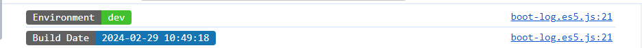

# @atom/boot-log



## Install

```sh
npm i @atom/boot-log --save
```

## Usage

```js
import bootLog, { green } from '@atom/boot-log';
bootLog({
  title: 'Environment',
  content: import.meta.env.VITE_APP_ENV,
  backgroundColor: green,
});

export const buildTime = DayJs(BUILD_TIME).format('YYYY-MM-DD HH:mm:ss');
bootLog({
  title: 'Build Date',
  content: DayJs(buildTime).format('YYYY-MM-DD HH:mm:ss'),
});
```

## License

MIT © zhiyingzzhou
